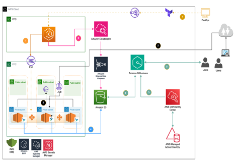
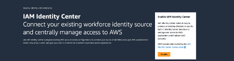

# Beyond Metrics: Extracting Actionable Insights from Applications and Amazon Elastic Kubernetes Service with Amazon Q Business

## Introduction

In today's dynamic and complex enterprise landscape, [Amazon Elastic Kubernetes](https://aws.amazon.com/pm/eks/?gclid=CjwKCAjw1NK4BhAwEiwAVUHPUF3sD8fuMnJmehgr0myUJnnUjSbX4WXm8xtUSiygRWlVYIkKDUn3IhoChyQQAvD_BwE&trk=cae70841-9b8a-4ec5-a5ea-ad8c76e382e4&sc_channel=ps&ef_id=CjwKCAjw1NK4BhAwEiwAVUHPUF3sD8fuMnJmehgr0myUJnnUjSbX4WXm8xtUSiygRWlVYIkKDUn3IhoChyQQAvD_BwE:G:s&s_kwcid=AL!4422!3!651751059756!p!!g!!amazon%20kubernetes%20service!19852662191!145019195217) has become the de facto standard for container orchestration, managing the deployment, scaling, and operation of applications. However, effectively monitoring and understanding the behavior of enterprise applications, extracting meaningful insights from the vast amount of data generated by Amazon EKS and application running on top can be challenging. Fortunately, the combination of Amazon Elastic Kubernetes Service and Amazon Q Business offers a powerful solution for unlocking actionable insights from your applications.

Kubernetes environments generate massive volumes of data from various sources, including control plane events, node metrics, pod logs, and application telemetry. Extracting meaningful insights from this scattered data through complex queries poses significant challenges, making manual analysis time-consuming, error-prone, and inaccessible for non-technical users. Generative AI and large language models (LLM) are fundamentally changing the way we interact with data, especially in the realm of Kubernetes and observability. 

This is where Amazon Q Business comes in. Amazon Q Business is a generative AI–powered assistant that can answer questions, provide summaries, generate content, and securely complete tasks based on data and information in your enterprise systems. It comes with a built-in user interface, where users ask complex questions in natural language, create or compare documents, generate document summaries, and interact with their third-party applications. It empowers employees to be more creative, data-driven, efficient, prepared, and productive.

Amazon Q Business is a fully managed service that enables you to query and analyze data from various sources, including the control plane, data plane, request rates as well as logs from your applications and services, providing organizations with a comprehensive understanding of their applications and Kubernetes environments. This allows you to gain a deeper understanding of how your applications are performing, identify potential issues and bottlenecks, and make data-driven decisions to optimize your Kubernetes environment.

One of the key benefits of using Amazon Q Business for analyzing and understanding your Kubernetes environment is its ability to handle large amounts of data. Unlike traditional tools that can become overwhelmed by the sheer volume of data generated by Kubernetes environments, Amazon Q Business is designed to handle scale and can handle petabytes of data with ease.

Using connectors makes it easy to synchronize data from multiple content repositories with your Amazon Q index. Connectors can be scheduled to automatically sync your index with your data source, so you're always securely searching through the most up-to-date content.

## Solution Overview

This post provides Terraform code and walks you through the steps necessary to deploy Amazon Elastic Kubernetes Services with [retail sample application](https://github.com/aws-containers/retail-store-sample-app) running on top of it. The terraform uses Amazon Kinesis data firehose to send the EKS control plane logs to S3. For Data planes The architecture uses Fluent Bit to collect container logs produced by a sample application running in an Amazon EKS cluster. Fluent Bit runs as a [DaemonSet](https://kubernetes.io/docs/concepts/workloads/controllers/daemonset/) and ships logs to a S3 bucket using fluent bit s3 exporter for permanent retention. Once the logs are available in Amazon S3, we use Amazon Q Business and it’s native S3 connector to synchronize, index the data and enable a chat experience powered by the Generative AI capabilities of Amazon Q Business



## Prerequisites

1. An AWS account with admin privileges: For this blog, we will assume you already have an AWS account with admin privileges.

2. Command line tools: Mac/Linux users need to install the latest version of [AWS CLI(>=2.17.63)](https://docs.aws.amazon.com/cli/latest/userguide/cli-chap-install.html), aws iam-authenticator, [kubectl](https://docs.aws.amazon.com/eks/latest/userguide/install-kubectl.html), and [terraform](https://learn.hashicorp.com/tutorials/terraform/install-cli) on their workstation. Whereas Windows users need to create a [Cloud9 environment](https://docs.aws.amazon.com/cloud9/latest/user-guide/create-environment-main.html) in AWS and then install these CLIs inside their Cloud9 environment.

3. The [Amazon S3](https://docs.aws.amazon.com/AmazonS3/latest/userguide/Welcome.html) bucket must be in the same AWS Region as your Amazon Q index, and your index must have permissions to access the bucket that contains your documents.

4. If you haven’t enabled IAM Identity Center, choose Enable. If there’s a pop-up, choose how you want to enable IAM Identity Center. For this example, select Enable only in this AWS account. Choose Continue.


## Steps

### Step 1: Create terraform backend remote state resources

To set up your workspace and get started with this post, open your favorite terminal in your Mac/Linux workstation,

Then clone [terraform codes](https://github.com/aws-samples/sample-amazon-eks-q-business-integration.git) in your current working directory 
 
 ``` 
 git clone https://github.com/aws-samples/sample-amazon-eks-q-business-integration.git
 ``` 
 
Change your current working directory to “Amazon-Q-business” by running the below command 
    
``` 
cd "$_" 
cat provider.tf 
```


This directory has a file name “provider.tf” that contains information’s about the provider you’ll be using with Terraform. As shown above, along with “aws” provider we will also be using “[awscc](https://registry.terraform.io/providers/hashicorp/awscc/latest)” providers which is powered by the [AWS Cloud Control API](https://aws.amazon.com/cloudcontrolapi/), to create Amazon Q Business and its dependencies in this blog.

We will pass the region name through a variable than hardcoding it. Since every script in this blog post is parametrized, you won’t need to change them. All the variables with their default values are stored in separate vars.tf file. If you need to make changes other than default, make it in vars.tf.

To store terraform states we are going to use Amazon S3. This backend also supports state locking and consistency checking via Dynamo DB, we are going to create first these two resources. 

To make it easier for you all we will use [make](https://www.gnu.org/software/make/manual/make.html) command for everything from this step onwards. To setup initial workspace and terraform backend, open a terminal go to your base directory and then run: 

```
make backend

```

This command will call terraform in the backend to create a DynamoDB table having name “app-state” and a S3 bucket with name “eks-amazonq-tfstate-###”, the last three characters in s3 name is random id. Together these two resource will keep terraform state files and achieve locking. You can edit 
On some READMEs, you may see small images that convey metadata, such as whether or not all the tests are passing for the project. You can use Shields to add some to your README. Many services also have instructions for adding a badge.

### Step 2: Create blog Architecture resources using terraform

After the initial workspace setup, we are ready to create our current blog environment, which includes the following resources:

•	VPC with a /16 IPv4 CIDR block and three Availability Zones (AZs) with public and private subnets (/24 IPv4 CIDR blocks)

•	An Internet Gateway

•	A NAT Gateway with an Elastic IPv4 address

•	Custom route tables for public and private subnets

•	A Cluster role for the EKS Cluster control plane

•	A worker role for managed node groups

•	Amazon EKS Cluster

•	Amazon EKS managed node group registered with the EKS Cluster

•	AWS Managed Active Directory with an admin password stored in AWS Secrets Manager

•	S3 bucket for storing EKS and application logs

•	Amazon Q Business Application, index, datastore, and necessary IAM roles for end-to-end functionality

To set up the blog environment shown in fig 1, ensure you’re in repo base directory and then run:

```
make deploy

```
This will take around 30 mins for terraform to deploy all the resources in us-east-1 region, if you would like to override the resources default name or value you can do so by updating “vars.tf” in the repo root directory. After the completion of the above make command command you should see output as seen in the following figure. In your case, the resources IDs could be different.


### Step 3: Deploy Sample Application and Fluent Bit to export container log to Amazon s3
Next, we will be deploying our [retail store sample application](https://github.com/aws-containers/retail-store-sample-app) on top of our EKS cluster which we have created in last step. This is a sample application designed to illustrate various concepts related to containers on AWS. It presents a sample retail store application including a product catalog, shopping cart and checkout. To deploy the application run below command in your terminal from the repo base directory:

```
make deployapp

```
### Step 4: Deploy Fluent Bit to export container log to Amazon s3
After sample application, we will deploy [AWS for Fluent Bit](https://github.com/aws/aws-for-fluent-bit) as a Daemon Set in the “default” namespace and it will be configured to forward pod logs to an S3 Bucket. Use [Helm](https://helm.sh/) which is a package manager for Kubernetes, to deploy the [aws-for-fluent-bit](https://github.com/aws/aws-for-fluent-bit). To customize and configure fluent-bit while deploying, we will use “s3-fluentbit-values.yaml” YAML file located in the terraform repo base directory. 
Replace the [irsa](https://docs.aws.amazon.com/emr/latest/EMR-on-EKS-DevelopmentGuide/setting-up-enable-IAM.html) serviceAccount role-arn, bucket name and region with values from your environment terraform created in  step 2 .You can also get those resources details by running “make  output”  command in your terminal. 


After updating “s3-fluentbit-values.yaml” run:

```
make fluentbit
```


Verify that Fluent Bit is running with one pod on each of the cluster nodes by running below command

```
kubectl get daemonset 
```

The control plane and data plane logs being queried through Amazon Q Business are stored in a single S3 bucket named “[eks-amazonq-business-datastore-<AWS Account Id>](https://us-east-1.console.aws.amazon.com/s3/buckets/eks-amazonq-business-datastore-304279660828?region=us-east-1)” under different folders : “eks-cluster/” and “pod-logs/”. After the logging is enabled you, start seeing the logs appear in the configured S3 Bucket as shown below. If for don’t see them check fluent-bit deployment and Amazon Kinesis data Firehose and ensure these resources have been created. 


### Step 5: Create users and groups in AD and Sync with IAM Identity Center
In this section, we will be creating users in [AWS Managed Microsoft AD](https://docs.aws.amazon.com/directoryservice/latest/admin-guide/directory_microsoft_ad.html) Active directory which we have created in Step 2. This will act as our centralized identity source for Amazon Q Business. Which We will integrate the AD with AWS IAM Identity Center in next step.
You can create the users through make command or through AWS Console. In this blow we will use make.

```
make users first_name last_name
```
Please note that in this step you need to provide users first_name last_name otherwise users creation will fail. After the user’s creation their accounts would be disabled as shown in below image, for the user to able to work with Amazon Q we need to reset their password and enable them.


To enable user and reset their password, Open [AWS Directory Service Console](https://us-east-1.console.aws.amazon.com/directoryservicev2/home?region=us-east-1#!/directories), select and open your Directory Service page. On this Page, at the bottom you will see the details of all the users in you AD along with their status.
1.	Select the user you created earlier 
2.	Click on Actions at the top right
3.	Then, click “Reset Password and enable account”
4.	A reset user password screen will appear, input strong password and then save click “Reset password”. 

This will enable and reset user password in AD. After user creations, next, we will go ahead and link our Identity source with AWS IAM Identity center. 

Open the [AWS IAM Identity Center](https://us-east-1.console.aws.amazon.com/singlesignon/home?region=us-east-1#!/)

Then, Go to Settings -> Identity source -> Action -> Change Identity Source -> Active Directory -> Next -> select “example.com” from existing directories -> Next -> ACCEPT “


Once you change the AD in Identity center it will ask you to sync users, Click on “Start guided setup” at the top right in green color.
1.	Click “Start guided setup” 
2.	Configure attribute mappings – optional page- Keep everything default and click Next
3.	Configure sync scope – optional – Under Users tab -> Search your user you created earlier -> Add -> Next -> Save configuration 


4.	Wait for the sync to finish, this would usually take a couple of mins.

Please Note Your environment may already may have an AD integrated with Identity center, run Step 5 only when there is no AD and you are working in a new clean account. If you already have AD, you can skip this step and ask your Admin to create a user for you.

## Step 6: Add users and groups in Amazon Q Business Application

In this section, we are going to set up users and groups to showcase how access can be managed in Amazon Q Business.

1.	Open the [Amazon Q Business console](https://us-east-1.console.aws.amazon.com/amazonq/business/welcome?region=us-east-1)
2.	Click On “Get Started”  Select Amazon Q Business Application having name “eks_amazonq_app“ which we created using terraform in Step 2
3.	On your application home page, click “Manage user access”-> Manage access and subscriptions page -> Add groups and users -> choose assign existing users and groups and choose Next -> Assign users and groups -> search your user -> Assign


[Amazon Q Business supports Pro and Lite plan](https://docs.aws.amazon.com/amazonq/latest/qbusiness-ug/tiers.html#user-sub-tiers) in our blog we will select “pro” for both users in the access and subscription page. 


## Step 7: Sync S3 data source

Next, we will crawl and update Amazon Q Business index with the latest EKS control plane, data plane and application logs in the S3 bucket created in step 2. Please note you want to update your index when your data source content changes. When you sync your data source with Amazon Q for the first time, all content is synced by default. You can run sync on-demand or on schedule, For more details, see Sync run schedule. To initiate sync run below make command in your terminal from the repo base directory

```
make sync
```
The sync can take from a few minutes to a few hours. If not completed already wait for the sync to complete. Verify the sync is complete and documents have been added.


## Step 8: Simulation and queries with Amazon Q

Now that we have our setup configured, ready and connected with the Amazon Q Business application and Active Directory through IAM Identity Center, we are ready for the simulation and log queries based on the scenarios outlined below. For simulations we have already deployed some resources together with our sample application in step 3. 
These resources will generate load to force ui pods to crash several times and then sync the logs with Amazon Q Business. Please wait for the data sync to finish, then run below make command in your terminal from the base directory and find the Amazon Q Business Web URL.

```
make output_app_url
```
Copy the Web experience URL, open it in your favorite browser, login as the user you created in step 5& 6. In our case we will login as jane@EXAMPLE.COM

### Simulation 1: 

Through the application deployment we have granted the user system:anonymous  access to view ClusterRole. This will allow an anonymous user to view all objects in your cluster using the Kubernetes API. This is generally an unexpected configuration and should be reviewed. After the Kubernetes resource creation, we have sync Amazon Q data source to index updated log in Amazon Q business.

After successful login, let’s query logs and see if Amazon Q can find this by asking: 

“Has the anonymous user been granted API permission on a Kubernetes cluster? what is the risk associated with it and how to fix it?”  You should see output similar to this: 


As you can see Amazon Q tells you the “systems:ananonymous“ user permission in the cluster and in second paragraph explains the risk associated with it with recommendations as well.

### Simulation 2: 

We have bind a ClusterRole and a ClusterRoleBinding definition with default service account in the default namespace to the cluster-admin ClusterRole. Any pod not associated to a specific service account make use of the default service account in their namespace. This configuration can provide unintentional elevated admin privileges to pods. 

When asked a question like “Has the default service account been granted admin privileges on a Kubernetes cluster?”

Amazon Q will provide a summary pulling information from Pods logs and Kubernetes system logs, highlighting the sources at the end of each excerpt.


### Simulation 3: 

In Step 3, We have created a deployment that has a  privileged container running with root level access. This is accomplished through the privileged: true setting in the securityContext configuration of the nginx container spec. Secondly, the container mounts /etc directory on the host as a writable volume.

When asked a question “List me all the pods that has spec "privileged: true" setting in the securityContext in default namespace?” 

Again, Amazon Q will provide a summary pulling information from Pods logs and Kubernetes system logs as shown below.


Let’s try to add an extra query and ask Amazon Q to provide you the steps to fix them and see what response we are getting from Amazon Q Business?

“List me all pods with privileged containers and sensitive host path mounts in the default namespace and outline me how to fix them?


You can see along with it’s response from the logs Amazon Q Business LLM is also providing you the recommendation to fix the security issue which you can apply on the cluster. Along with the insights it’s also providing you the corrective steps.

### Simulation 4: 

In this simulation, using [Locust](https://locust.io/) we would generate load to our retail sample microservice application’s ui microservice and force UI pod to crash several times and ask

Queries related to Control plane on EKS

Let’s query some control plane data by asking “Give me the UI deployments specs in yaml format?”


You can see from the output, Amazon Q Business from logs, regenerates the spec files for you. You can quickly glance through the specs and identify the errors.


Amazon Q respects the access control rules set up in the Amazon S3 data source as well. If you are interested in setting that up you can follow this [blog](https://aws.amazon.com/blogs/machine-learning/discover-insights-from-amazon-s3-with-amazon-q-s3-connector/).

## Clean up

To clean everything up, follow these steps:
1.	Remove the AWS Managed Active Directory created for this blog from Identity center and link it to “Identity Center directory”

In the IAM Identity Center dashboard, choose Settings -> Identity source -> Action -> Change Identity Source -> Identity Center directory -> Next -> ACCEPT “

2.	After removing the identity source from AD,run below make command to delete everything from the AWS account.

```
make cleanup
```
Please take extra precaution while running this command, this will wipe out everything. So please ensure you are inside the directory you created in Step 1 and then run this.

## Conclusion

Amazon Q Business offers a powerful solution for organizations looking to gain deeper insights into their Kubernetes environments. By adopting Amazon Q Business, organizations can gain unprecedented visibility into their enterprise applications and Kubernetes environments. This enhanced visibility enables proactive problem-solving, improved performance optimization, and better decision-making, identify performance bottlenecks, troubleshoot issues, and optimize resource utilization. 
In this This blog provide a comprehensive guide on how to create an EKS cluster and sends it control plane, data plane logs using Amazon Data Firehose and fluent bit to Amazon S3, and then connected those logs its using native S3 connectors to extract actionable insights from the control plane, data plane, and application logs using Amazon Q Business

## Disclaimer: 

The sample code, software libraries, command line tools, proofs of concept, templates, or other related technology (including any of the foregoing that are provided by our personnel) are provided to you as AWS Content under the AWS Customer Agreement, or the relevant written agreement between you and AWS (whichever applies). You should not use this AWS Content in your production accounts, on production, or on other critical data. You are responsible for testing, securing, and optimizing the AWS Content, such as sample code, as appropriate for production grade use based on your specific quality control practices and standards. Deploying AWS Content may incur AWS charges for creating or using AWS chargeable resources, such as running Amazon EC2 instances or using Amazon S3 storage.

